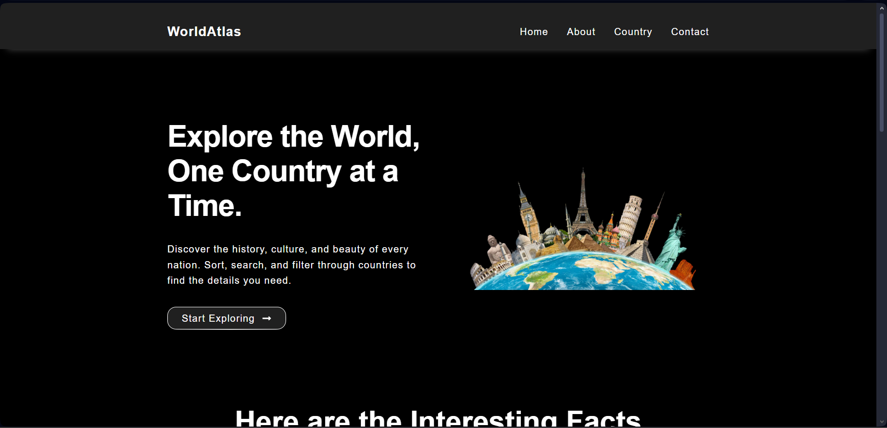

# 🌍 Country Website - React

This is a **fully responsive React web application** that displays detailed information about countries around the world using the [REST Countries API](https://restcountries.com/).

## ✨ Features
- 🌎 Search and explore countries from all around the world  
- 🏳️ Displays **flag, currency, name, population, region, languages**, and more  
- 🔍 Search bar to quickly find any country
- 🔎 Filter countries by region
- 📱 Fully responsive design (works on mobile, tablet, and desktop)  
- ⚡ Fast and dynamic, powered by React functional components and hooks  

## 🛠️ Tech Stack
- **React.js** – for building UI  
- **REST Countries API** – for real-time country data  
- **CSS** – for styling and responsiveness  
- **Vercel** – for deployment  

## 🚀 Live Demo
👉 [View Live Website](https://country-website-react.vercel.app/)

## 📂 Repository
👉 [GitHub Repo](https://github.com/ShahmirAliQureshii/country-website-react)

## 📸 Screenshots

## 📌 Future Improvements
- Dark/Light mode toggle 
- Add favorites/bookmark feature  

## 📂 LinkedIn
👉 [Follow Me On LinkedIn](https://www.linkedin.com/in/shahmir-qureshi-162200252)
